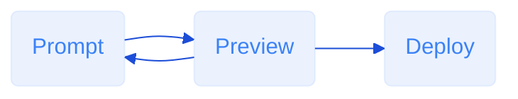

Easel is a full-stack app builder that turns natural language into real, working code — and a real, working app. Whether you're a developer who wants full control or someone who's never written a line of code, Easel lets you go from idea to deployment in minutes.

You describe what you want. Easel builds it.

## Roadmap

| **Feature**      | **Description**                               | **Maturity Level** |
| ---------------- | --------------------------------------------- | ------------------ |
| Frontend / UI    | Build websites and user interfaces with Easel | 🟢 Mature          |
| Data Persistence | Store and retrieve data with a database       | 🕑 Coming soon     |
| Authentication   | Allow users to log in to your app             | 🕑 Coming soon     |
| API Keys         | Securely store api keys                       | 🕑 Coming soon     |
| Deployment       | Host and deploy your sites with Easel         | 🕑 Coming soon     |

## Getting Started

It only takes a few minutes to build your first real, working app — with zero setup.

<CardGroup cols={2}>
  <Card title="Create Your First App" icon="stairs" href="/quickstart" cta="Try now">
    Learn how to use Easel to build websites and apps.
  </Card>
  <Card title="Prompt Engineering" icon="robot" href="/prompt-engineering" cta="Read now">
    Learn how to write effective prompts to get the most out of your messages with Easel.
  </Card>
</CardGroup>

## What is Easel?

Easel is a full-stack app builder powered by natural language. You describe what you want to build, and Easel turns it into working code — complete with components, logic, layout, and interactivity.

Whether you’re a developer or you’ve never written code before, Easel helps you go from idea to deployed app in minutes.

### The Core Workflow

Easel is designed around a simple but powerful workflow:

- **Describe** your app or feature in plain language.
- Easel **generates** the UI, layout, and logic instantly.
- **Edit** using the visual editor, the code view, or more prompts.
- See your app in the **live preview** as you go.
- When you're ready, **deploy** or export your code.

<Check>
  You can always switch between visual editing and code. And everything you see is real, editable code — no black boxes or hidden systems.
</Check>

### What can you build with Easel?

Easel is versatile and can build a wide range of apps and components. It's only limited by your imagination and prompt engineering skills.

Some examples of what you can build with Easel:

<CardGroup cols={2}>
  <Card title="Landing Pages" icon="browser">
    Demonstrate your product or service with a beautiful landing page.
  </Card>
  <Card title="Forms" icon="puzzle">
    Collect user feedback with a form that sends emails to your team.
  </Card>
  <Card title="Components" icon="diamonds-4">
    Build reusable components like buttons, modals, and cards.
  </Card>
  <Card title="Apps" icon="window">
    Build a full-stack app with a database, authentication, and more.
  </Card>
</CardGroup>
